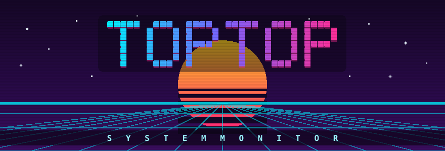

<div align="center">



<br>

### the local‑inference observability layer for your terminal

**Live tokens/sec · VRAM‑spill & throttle warnings · the GPU metrics `nvidia-smi` can't show —
with a gorgeous full system monitor underneath. Rust · one tiny binary · zero deps.**

[](https://github.com/ur-grue/toptop/actions/workflows/ci.yml)
[](https://www.rust-lang.org)
[](LICENSE)


[AI view](#-for-ai-engineers) · [Fleet](#-multi-host-fleet-view) · [Prometheus](#-export--observability) · [Install](#-install) · [Features](#-features) · [Themes](#-themes)

</div>

---

**The local‑inference view (press `a`) — the numbers `nvidia-smi` doesn't show you:**



<details>
<summary>📄 text version (what it looks like in your terminal)</summary>

```text
╭ AI · local-LLM GPU view · Esc/a to close ──────────────────────────────────╮
│⚠ ALERTS                                                                    │
│  [warn] gpu0 VRAM 92% — risk of spilling to RAM                            │
│                                                                            │
│gpu0  NVIDIA GeForce RTX 4090   290/450W  72°C                              │
│  compute   █████████▎░░░░░░░░░░░░░░░░░░░░  31%                             │
│  mem b/w   ███████████████████████▍░░░░░░  78%                             │
│  vram      ███████████████████████████▌░░ 22.0 GiB / 24.0 GiB              │
│             ⚠ near VRAM limit — models may spill to RAM (5–20× slower)     │
│                                                                            │
│Inference servers (auto-discovered)                                         │
│  vLLM :8000  meta-llama/Llama-3-8B                                         │
│    83.4 tok/s (0.29 tok/s/W)  prefill 1240/s  kv 64%  req 2/5  ttft 180ms  │
│                                                                            │
│GPU processes (by VRAM)                                                     │
│      PID       VRAM   CPU%  PROCESS                                        │
╰────────────────────────────────────────────────────────────────────────────╯
```
</details>

> Local LLMs are **memory‑bandwidth bound** once the model is resident, so a GPU at "31% util" can
> still be your bottleneck. toptop shows **compute vs. bandwidth** side by side, warns **before**
> VRAM spills to system RAM (a 5–20× slowdown), reads the driver's throttle reasons, and
> **auto‑discovers your inference servers** (vLLM · llama.cpp · Ollama · TGI · TensorRT‑LLM · LM Studio) to scrape live
> **tokens/sec**, KV‑cache pressure and queue depth — then exports it as JSON **or Prometheus**
> for Grafana, or fans out across a cluster with the [fleet view](#-multi-host-fleet-view).

> **🎮 Try the AI view right now — no GPU needed:**
> ```bash
> toptop --demo
> ```
> Simulates a busy RTX 4090 + vLLM server on top of your real system: tokens/sec tick, the
> VRAM meter climbs to the spill threshold, alerts fire. Your processes, CPU and memory stay real.

<details open>
<summary><b>🖥️ …and a gorgeous full system monitor</b> &nbsp;(the default view)</summary>

```text
▟▛ toptop  vm  Linux (Ubuntu 24.04)  kernel 6.18.5  up 00:03:50  load 0.34 0.39 0.18  111 tasks, 1 run
╭ cpu ─────────────────────────────────────╮╭ memory ───────────────────────╮╭ network ──────────────────────╮
│all   2.4%  2.80 GHz  4c/4t               ││ram   3.8%  608 MiB / 15.7 GiB ││eth0  ↓ 0 B/s      ↑ 0 B/s     │
│                                          ││█▏░░░░░░░░░░░░░░░░░░░░░░░░░░░░░││Σ ↓1015 KiB  ↑11.4 MiB         │
│                                          ││swp   0.0%  0 B / 0 B          ││                               │
│                                          │╰───────────────────────────────╯╰───────────────────────────────╯
│                                        ⢠ │╭ sensors ──────────────────────╮╭ disk ─────────────────────────╮
│ 0 ░░░░░░   0  1 ░░░░░░   0               ││no sensors detected            ││io R 0 B/s      W 0 B/s        │
│ 2 ▎░░░░░   3  3 ▎░░░░░   3               ││                               ││/       ██████▎  89% 252G      │
╰──────────────────────────────────────────╯╰───────────────────────────────╯╰───────────────────────────────╯
╭ processes · CPU% (▼) ──────────────────────────────────────────────────────────────────────────────────────╮
│PID     USER      CPU%  MEM%  MEM     DISK     TIME    S COMMAND                                            │
│   3715 root        6.3   0.0 5.8M    ·        00:01   R target/debug/examples/preview 110 18               │
│    553 root        3.1   2.3 376M    ·        02:55   S claude --output-format=stream-json --verbose --sett│
│    568 root        0.0   2.3 376M    ·        02:52   S claude --output-format=stream-json --verbose --sett│
│    557 root        0.0   0.0 0       ·        02:54   I kworker/2:1H-kblockd                               │
╰────────────────────────────────────────────────────────────────────────────────────────────────────────────╯
?:help a:ai Enter:detail n:net s:sort t:tree /:filter K:signal L:layout q:quit
```

High‑resolution braille graphs, truecolor gradient meters, an interactive process table (tree,
filter, click‑to‑sort, signal menu), per‑interface network, per‑mount disk + I/O, temperature
sensors, battery, seven themes — all in a single **~1 MB binary with zero runtime dependencies**.
</details>

<details>
<summary><b>🛰️ Multi‑host fleet view</b> &nbsp;(<code>--remote</code>) — monitor a whole inference cluster</summary>

```text
▟▛ toptop fleet  4 hosts · 3 online  · 6 GPUs · Σ vram 74G/184G  · Σ 154 tok/s              11:13:20
╭ hosts ───────────────────────────────────────────────────────────────────────────────────────────╮
│HOST             STATUS           CPU%  MEM   LOAD   GPU%  VRAM     TOK/S   TASKS  UP             │
│gpu-node-1       ● online         37    53    4.6    91    41G      58      512    1d 00:00:00    │
│gpu-node-2       ● online         88    91    11.0   22    12G      12      512    1d 00:00:00    │
│inference-3      ● online         12    28    1.5    76    21G      83      512    1d 00:00:00    │
│offline-box      ✕ ssh: connect:… —     —     —      —     —        —       —      —              │
╰──────────────────────────────────────────────────────────────────────────────────────────────────╯
```
</details>

## ✨ Features

**For local inference / LLMOps**

| | |
|---|---|
| 🤖 **AI / local‑LLM view** | compute **vs. memory‑bandwidth** util, VRAM spill warning, throttle flag, per‑process VRAM, tokens/sec/watt, serving‑vs‑training detection (press `a`) |
| 🔭 **Server auto‑discovery** | finds listening vLLM / llama.cpp / Ollama / TGI / TensorRT‑LLM / LM Studio and scrapes live **tokens/sec**, KV‑cache, queue depth, TTFT — no config |
| 🎮 **Multi‑vendor GPU** | NVIDIA (`nvidia-smi`) **and** AMD/Intel (`sysfs`), polled off‑thread — util, bandwidth, VRAM, power, temp, throttle |
| 📡 **Prometheus exporter** | `--serve-metrics` runs a `/metrics` endpoint (or `--export prometheus`) — scrape tokens/sec, VRAM, throttle into Grafana |
| 🚨 **Threshold alerts** | VRAM‑spill, GPU‑throttle, KV‑cache and queue‑backlog alerts — a red TUI banner **and** `toptop_alert` gauges for Alertmanager |
| 🛰️ **Multi‑host fleet** | `--remote h1,h2,…` aggregates a cluster over SSH — Σ tokens/sec, Σ VRAM, per‑host status |

**As a general system monitor**

| | |
|---|---|
| 📊 **High‑res braille graphs** | 2×4 dots per cell → 4× the detail of block graphs, with a vertical load gradient |
| 🌈 **Truecolor gradient meters** | CPU (global + per‑core), RAM, swap, disks, GPU and sensors |
| 🧠 **Interactive process table** | sort 6 ways, tree view, live filter, click‑to‑sort headers, full mouse support |
| 🔎 **Process detail · I/O** | PPID, threads, RSS/virtual mem, **live disk I/O rates**, exe, cwd; a sortable `DISK` column |
| ☠️ **Signal menu** | send any of nine signals (`SIGTERM`…`SIGUSR2`) behind a confirmation prompt; the status line distinguishes **delivered** from **permission denied** (signalling another user's process needs `sudo`) and **already‑exited**, so a failed signal explains itself instead of silently doing nothing |
| 🌐 **Network + connections** | per‑interface rx/tx braille graph; a live TCP/UDP table mapping sockets → process (`n`) |
| 🗄️ **Disk + sensors** | per‑mount usage, read/write I/O graph, temperatures, battery |
| 📊 **Inference SLO triad** | TTFT and TPOT p50/p95/p99 from vLLM/TGI/TensorRT-LLM/SGLang histograms, plus the prefill-vs-decode phase mix |
| 🔎 **Diagnosis, not just numbers** | Reads the signals together and names the bottleneck — bandwidth-bound, KV thrashing, queue-starved, spilled, throttled — with the evidence and what to change |
| ⟲ **KV-cache preemption** | The signal no other tool shows: requests thrown away and recomputed because the cache ran out — a critical alert, not a footnote |
| 📉 **Compute vs bandwidth over time** | A mirrored braille graph per GPU: compute above the line, memory bandwidth below. The divergence *is* the diagnosis |
| ⏺️ **Flight recorder** | `--record` writes JSONL snapshots per tick; `--replay` scrubs them in the full TUI on any machine |
| 🎨 **Seven themes & layouts** | `gruvbox` · `nord` · `dracula` · `tokyonight` · `matrix` · `cyberpunk` · `paper` (light terminals); `full`/`cpu`/`process` presets |
| 🪶 **Tiny & safe** | ~1 MB binary, zero runtime deps, adaptive 250‑col→tiny layout, restores your terminal even on panic |

## 🤖 For AI engineers

Press **`a`** (or launch with **`--ai`**) for a view built around the question
*"why is my model slow?"* — the metrics a bare `nvidia-smi` doesn't make obvious:

- **Compute vs. memory‑bandwidth utilization.** Once a model fits in VRAM,
  token generation is almost always **bandwidth**‑bound, not compute‑bound — so
  toptop shows `utilization.memory` as its own meter next to core %. A GPU at
  "30% utilization" that's actually saturating memory bandwidth is your bottleneck.
- **VRAM headroom with a spill warning.** VRAM is a hard wall: cross it and your
  runtime offloads layers to system RAM for a **5–20× slowdown**. toptop colors
  the VRAM meter by pressure and warns *before* you spill.
- **Per‑process VRAM.** See exactly which PID is holding GPU memory — catch a
  model "squatting" on VRAM (`keep_alive`) or confirm your server is resident.
- **Power vs. limit + throttle flag.** Thermal/power throttling silently drops
  tokens/sec; toptop reads the driver's throttle reasons and flags it.
- **Inference‑runtime detection.** Ollama, llama.cpp, vLLM, SGLang, TGI,
  KoboldCpp, ExLlama, MLX, LocalAI and friends are recognized and listed with
  their CPU, RAM and VRAM — including **CPU‑only** inference when there's no GPU.

### …and the numbers `nvidia-smi` can't see

toptop already knows which PIDs are inference runtimes **and which ports they
listen on**, so it auto‑discovers your local servers and scrapes their metrics
endpoints — no config, no exporters:

- **Live tokens/sec** (generation *and* prefill), **KV‑cache pressure**, **queue
  depth** and **TTFT**, read straight from llama.cpp / vLLM / TGI Prometheus
  `/metrics` and Ollama `/api/ps` — over a tiny dependency‑free localhost client
  on a background thread.
- **tokens/sec/watt** — throughput fused with GPU power draw, the efficiency
  number that maps to your electricity/cloud bill.
- **Serving vs. training** — training launchers (torchrun, DeepSpeed, Axolotl,
  Unsloth, LLaMA‑Factory, Megatron, torchtune…) are detected too, with a
  **dataloader‑bound** hint when a run pins a CPU while the GPU sits idle.
- **Multi‑GPU aggregate** — Σ VRAM and Σ power across cards, with a **sharding
  imbalance** warning when one GPU is hot and the others idle.

```text
Inference servers (auto-discovered)
  vLLM :8000  meta-llama/Llama-3-8B
    83.4 tok/s (0.29 tok/s/W)  prefill 1240/s  kv 64%  req 2/5  ttft 180ms
```

## 🥊 How it compares

| | **toptop** | htop | btop | nvtop / nvitop |
|---|:---:|:---:|:---:|:---:|
| Full system monitor (CPU/mem/net/disk/procs) | ✅ | ✅ | ✅ | ✖️ (GPU-focused) |
| GPU utilization + VRAM | ✅ | ✖️ | ✅ | ✅ |
| Compute **vs. memory-bandwidth** side by side | ✅ | ✖️ | ✖️ | partial |
| Inference-server auto-discovery (tokens/sec, KV, TTFT) | ✅ | ✖️ | ✖️ | ✖️ |
| VRAM-spill / throttle / queue **alerts** | ✅ | ✖️ | ✖️ | ✖️ |
| Prometheus exporter built in | ✅ | ✖️ | ✖️ | ✖️ |
| Multi-host fleet view over SSH | ✅ | ✖️ | ✖️ | ✖️ |
| Zero runtime dependencies | ✅ | ✅ | ✅ | ✖️ (needs NVML) |

All of those are excellent tools — toptop's lane is the **local-inference observability** column.

## 📡 Export & observability

toptop isn't just a live dashboard — it's a metrics **source**. Emit a snapshot as
machine‑readable JSON or **Prometheus** exposition text and scrape it into Grafana /
VictoriaMetrics to chart tokens/sec, VRAM pressure, throttle events and queue depth over time:

```bash
toptop --export json          # one-shot snapshot (GPU bandwidth/power + server tokens/sec)
toptop --export prometheus    # one-shot Prometheus text
toptop --serve-metrics        # long-running /metrics endpoint on 127.0.0.1:9709
toptop --serve-metrics 0.0.0.0:9709   # bind elsewhere
```

```text
# TYPE toptop_gpu_mem_bandwidth_percent gauge
toptop_gpu_mem_bandwidth_percent{gpu="0",name="NVIDIA GeForce RTX 4090"} 78.00
# TYPE toptop_inference_tokens_per_second gauge
toptop_inference_tokens_per_second{runtime="vLLM",port="8000",model="meta-llama/Llama-3-8B"} 83.40
# TYPE toptop_alert gauge
toptop_alert{key="vram_spill",detail="gpu0",level="warn"} 1
```

**Threshold alerts** fire on the things that actually hurt local inference — VRAM about to
spill, GPU throttling, KV‑cache saturation, request‑queue backlog. They show as a red banner in
the TUI (top of the `a` view) **and** as `toptop_alert{…}` gauges, so you can page on them with
Prometheus Alertmanager. The same JSON powers the multi‑host fleet view below.

A ready-made **Grafana dashboard** (tokens/sec, compute-vs-bandwidth, VRAM, KV/queue,
power/temp, firing alerts) ships at
[`assets/grafana/toptop-dashboard.json`](assets/grafana/toptop-dashboard.json) —
*Dashboards → Import*, pick your Prometheus datasource, done.

## 🔒 What it accesses

No surprises for serious infra: toptop is **read‑only**, **local‑first**, and has **no daemon
and no telemetry**. GPU stats come from `nvidia-smi` / `sysfs`; inference metrics from a
**localhost‑only** HTTP scrape of servers you're already running; the fleet view shells out to
**`ssh` using your own keys/agent** (`BatchMode`, never prompting). Nothing is sent anywhere you
don't point it at.

## 🛰️ Multi-host fleet view

Point toptop at a list of machines and it becomes a **local‑cluster dashboard** —
each host is polled over SSH (it just runs `toptop --export json` there), parsed,
and aggregated:

```bash
toptop --remote gpu-node-1,gpu-node-2,inference-3      # SSH hosts (and 'local')
toptop --remote-cmd "/opt/bin/toptop --export json" --remote box-a,box-b
```

```text
▟▛ toptop fleet  4 hosts · 3 online  · 6 GPUs · Σ vram 74G/184G  · Σ 154 tok/s              11:13:20
╭ hosts ───────────────────────────────────────────────────────────────────────────────────────────╮
│HOST             STATUS           CPU%  MEM   LOAD   GPU%  VRAM     TOK/S   TASKS  UP             │
│gpu-node-1       ● online         37    53    4.6    91    41G      58      512    1d 00:00:00    │
│gpu-node-2       ● online         88    91    11.0   22    12G      12      512    1d 00:00:00    │
│inference-3      ● online         12    28    1.5    76    21G      83      512    1d 00:00:00    │
│offline-box      ✕ ssh: connect:… —     —     —      —     —        —       —      —              │
╰──────────────────────────────────────────────────────────────────────────────────────────────────╯
╭ host · gpu-node-1 ───────────────────────────────────────────────────────────────────────────────╮
│Linux (Ubuntu 24.04)   load 4.62 3.70 3.08   up 1d 00:00:00   512 tasks (4 run)   18ms            │
│cpu   ███████████▏░░░░░░░░░░░░░░░░░░ 37%                                                          │
│mem   ████████████████░░░░░░░░░░░░░░ 34.0 GiB / 64.0 GiB                                          │
│vram  ███████████████▍░░░░░░░░░░░░░░ 41.0 GiB / 80.0 GiB  ·  2 GPU  ·  620 W                      │
│  vLLM Llama-3-70B  58.3 tok/s  kv 68%                                                            │
│                                                                                                  │
│                                                                                                  │
│                                                                                                  │
│                                                                                                  │
╰──────────────────────────────────────────────────────────────────────────────────────────────────╯
↑/↓:select p:theme q:quit
```

Aggregate **Σ tokens/sec** and **Σ VRAM** across the fleet; select a host to see its
CPU/MEM/VRAM meters and per‑server tokens/sec. Offline hosts show the SSH error inline
and keep retrying. No agent, no daemon, no open ports — just SSH and the single binary.

## 🚀 Install

**From source** (requires a Rust toolchain, 1.88+):

```bash
git clone https://github.com/ur-grue/toptop && cd toptop
cargo build --release
./target/release/toptop          # or: cargo install --path .
```

**Debian / Ubuntu** (`.deb` from the [v1.0.0 release](https://github.com/ur-grue/toptop/releases/latest)):

```bash
wget https://github.com/ur-grue/toptop/releases/download/v1.0.1/toptop_1.0.1-1_amd64.deb
sudo apt install ./toptop_1.0.1-1_amd64.deb   # installs binary, man page, completions
```

**Binary tarball** (x86_64 Linux):

```bash
curl -L https://github.com/ur-grue/toptop/releases/download/v1.0.1/toptop-1.0.1-x86_64-linux.tar.gz | tar xz
./toptop-1.0.1-x86_64-linux/toptop
```

**Homebrew** (this repo is its own tap — the [formula](Formula/toptop.rb) is pinned to v1.0.1):

```bash
brew tap ur-grue/toptop https://github.com/ur-grue/toptop
brew trust ur-grue/toptop            # one-time: Homebrew requires approving third-party taps
brew install toptop                  # or: brew install --HEAD toptop for the tip of main
```

### Platform support

`toptop` is **Linux-first**, and **verified on macOS** (Homebrew source build on an
Intel iMac): per‑core CPU, memory, network, disk **including per‑process I/O rates**,
**temperature sensors** (SMC), and the full process table all work. The Linux‑specific
parts — GPU metrics (`nvidia-smi`/`sysfs`), battery, and the `/proc`‑based connections
inspector — degrade gracefully to empty panels there (Apple‑GPU support is tracked in
[#4](https://github.com/ur-grue/toptop/issues/4)). On light terminal backgrounds, use
`--theme paper`.

**Windows** is **best-effort**: it builds and its tests run in CI on
`windows-latest`, and the process table, CPU/memory/network/disk rates, themes,
layouts and the NVIDIA GPU panel (via `nvidia-smi.exe`) work. What does not:
the connections inspector and inference-server discovery both parse `/proc` and
show a one-line explanation instead of an empty panel; renicing reports
"unsupported" (Windows uses priority classes, not nice values); and the signal
menu offers only *Terminate*, since Windows has no signals. Native equivalents
are open for contribution —
[#45](https://github.com/ur-grue/toptop/issues/45).

## 🎛️ Usage

```text
toptop [OPTIONS]

OPTIONS:
    -t, --tick <MS>      Refresh interval in milliseconds (100‑60000)
        --theme <NAME>   Color theme (gruvbox, nord, dracula, tokyonight, matrix, cyberpunk,
                         paper, or a user theme from ~/.config/toptop/themes/<name>.conf)
        --tree           Start in process‑tree view
        --no-tree        Start in flat process view
        --ai             Open the AI / local‑LLM GPU view on launch
        --remote <HOSTS> Multi‑host fleet view (comma‑separated SSH hosts; 'local')
        --remote-cmd <C> Command run on each remote (default: toptop --export json)
        --config <PATH>  Use an explicit config file (default: ~/.config/toptop/config.conf)
        --no-save        Don't write the config back on exit
        --list-themes    Print available themes and exit
        --snapshot       Print a one‑shot text snapshot and exit (no TUI)
        --export <FMT>   Print metrics and exit: 'json' (default) or 'prometheus'
        --serve-metrics [ADDR]  Run a Prometheus /metrics endpoint (default 127.0.0.1:9709)
        --alert-vram <PCT>   VRAM % that triggers the spill‑risk alert (default 90)
        --alert-kv <PCT>     KV‑cache % considered saturated (default 95)
        --alert-queue <N>    Queued requests considered a backlog (default 8)
        --alert-preempt <R>  KV-cache preemptions/sec that trigger a critical alert
                             (default 0.2 — preemption throws away completed work)
        --alert-cmd <CMD>    Shell command run on every alert fire/resolve
                             (TOPTOP_ALERT_{STATE,SEVERITY,KEY,DETAIL,MSG} in its env)
    -h, --help           Show help
    -V, --version        Show version
```

## ⌨️ Keybindings

| Key | Action | Key | Action |
|-----|--------|-----|--------|
| `↑`/`↓` `k`/`j` | move selection | `t` | toggle process tree |
| `PgUp`/`PgDn` | page up / down | `e` | toggle per‑core CPU meters |
| `Home`/`End` `g`/`G` | first / last | `a` | AI / local‑LLM GPU view |
| `Enter` | process detail view | `n` | network connections |
| `s` | cycle sort column | `L` | cycle layout preset |
| `i` | invert sort order | `p` / `P` | next / previous theme |
| `A` | alert history timeline | | |
| `Enter` | process detail (open files · sockets · env) | | |
| click header | sort by column | `+` / `-` | faster / slower refresh |
| `/` | filter processes | `space` | pause / resume |
| `K` / `F9` | signal menu | `?` / `F1` | help overlay |
| `Del` | terminate (SIGTERM) | `x` | kill (SIGKILL) |
| `Esc` | close overlay / clear filter / quit | `q` / `Ctrl‑C` | quit |

## 🎨 Themes

Cycle live with `p` / `P`, or launch with `--theme <name>`:

`gruvbox` &nbsp;·&nbsp; `nord` &nbsp;·&nbsp; `dracula` &nbsp;·&nbsp; `tokyonight` &nbsp;·&nbsp; `matrix` &nbsp;·&nbsp; `cyberpunk` &nbsp;·&nbsp; `paper` (for light backgrounds)

Each theme defines a full semantic palette **and** a load gradient (green → yellow → red),
emitted as true 24‑bit RGB so meters and graphs interpolate smoothly on any modern terminal.

## 🧱 Architecture

`toptop` is a small, testable **library** (`src/lib.rs`) with a thin binary on top:

| Module | Responsibility |
|--------|----------------|
| `metrics` | `sysinfo` handles + time‑series histories; CPU/mem/net/disk/proc data |
| `metrics::gpu` | NVIDIA (`nvidia-smi`) + AMD/Intel (`sysfs`) GPU polling, off the UI thread |
| `metrics::ai` | local‑AI workload taxonomy (serving vs. training runtimes) |
| `metrics::infer` | inference‑server discovery + Prometheus/Ollama scraping (tokens/sec) |
| `metrics::netconn` | `/proc/net/*` parsing and socket→PID mapping |
| `alerts` | threshold rules (VRAM spill / throttle / KV / queue) → firing alerts |
| `export` + `serve` | JSON & Prometheus serializers + the `/metrics` HTTP endpoint |
| `json` + `fleet` | dependency‑free JSON parser + multi‑host SSH aggregation |
| `history` | fixed‑capacity ring buffer feeding the graphs |
| `theme` | themes and the truecolor gradient engine |
| `ui` + `ui::graph` + `ui::fleet` | all rendering; braille‑graph and gradient‑meter primitives |
| `app` | state machine: input, sort/filter/tree, selection, signals, layout |
| `config` | dependency‑free config with optional persistence |

### Development

```bash
cargo test                          # unit + headless render integration tests
cargo clippy --all-targets          # lint (CI runs with -D warnings)
cargo run --example preview 120 40  # render one frame as plain text
cargo run --example fleet_preview   # render the fleet dashboard with sample hosts
cargo run -- --snapshot             # one-shot textual snapshot
python3 scripts/make_banner.py      # regenerate the pixel-art banner (assets/banner.svg)
python3 scripts/make_ai_demo.py     # regenerate the animated AI-view demo (assets/ai-demo.svg)
```

The render tests drive the **full UI** through ratatui's headless `TestBackend` across
terminal sizes from 1×1 upward, so layout regressions and geometry panics are caught in CI
without a real terminal. Pure parsers (GPU, connections, gradients, formatting) are unit‑tested
directly.

## 🐚 Shell completions

Completion scripts for bash, zsh, and fish live in [`completions/`](completions/):

```bash
source completions/toptop.bash                    # bash (or copy to /etc/bash_completion.d/)
cp completions/_toptop ~/.zfunc/                  # zsh  (ensure ~/.zfunc is on your $fpath)
cp completions/toptop.fish ~/.config/fish/completions/   # fish
```

### The diagnosis: *why* is it slow?

Every other panel reports numbers. The AI view leads with what they **mean**
together — because the diagnostic value of inference telemetry is almost
entirely in the combinations. A GPU at 31% compute is meaningless alone,
damning next to 94% memory bandwidth, and irrelevant next to a server that is
preempting:

```
▲ KV CACHE THRASHING   vLLM:8000 preempting 1.2/s
  → Requests are being evicted mid-flight and recomputed. Lower the max
  concurrent sequences, or give the cache more room (higher
  gpu-memory-utilization, shorter max context).
◆ MEMORY-BANDWIDTH BOUND   bandwidth 94% · compute 31%
  → Token generation is limited by memory bandwidth, not compute — a faster
  GPU core would not help. Quantize further, or batch more requests so each
  weight read serves more tokens.
```

Each verdict states the evidence it rests on, so you can check it rather than
believe it. The rules cover VRAM exhaustion, KV-cache thrashing, queue-bound
under-feeding, the bandwidth-vs-compute split, throttling and the classic
training data-loader bottleneck — and when none of them fit, it says so instead
of going quiet.

### KV-cache preemption — the metric nothing else surfaces

When a serving runtime runs out of KV cache, it **preempts** in-flight
requests: the work already done on them is thrown away and recomputed later.
Throughput collapses, latency spikes — and every dashboard still shows a busy,
healthy-looking GPU. `nvidia-smi` cannot see it, and neither can any other
terminal monitor.

toptop scrapes the counter, differences it into a rate, and treats a sustained
nonzero rate as **critical** — above a queue backlog, because a backlog only
delays work while preemption destroys work already done:

```
  vLLM:8000  Llama-3-8B
    83.4 tok/s  prefill 1200/s  kv 99%  req 4/12  ⟲ preempt 1.8/s
```

Tune with `alert_preempt = 0.5` or `--alert-preempt 0.5`; exported as
`toptop_inference_preemptions_{total,per_second}`.

### Compute vs memory bandwidth, over time

Token generation is memory-bandwidth-bound once the model is resident. toptop
draws both as one mirrored braille graph per GPU — compute above the midline,
bandwidth below:

```
  trend      compute ▲  /  ▼ bandwidth
             ⢀⣀⣠⣤⣶⣶⣤⣄⣀⡀⢀⣀⣠⣤⣶
             ⠉⠛⠿⣿⣿⣿⣿⣿⣿⣿⣿⣿⣿⣿⣿
```

Bandwidth pinned while compute idles means you are memory-bound and a faster
GPU core will not help you. That divergence is the whole diagnosis, and it is
only visible over time.

### Remote and non-Linux inference servers

Auto-discovery walks `/proc` to map listening sockets to runtime processes, so
it is localhost- and Linux-only. `--llm-server` bypasses it entirely:

```bash
toptop --llm-server gpu-box:8000 --llm-server 10.0.0.5:11434
toptop --ai --llm-server '[::1]:8000'      # bracket IPv6 literals
```

Repeatable, and settable as `llm_servers = gpu-box:8000, 10.0.0.5:11434` in the
config. Manual targets are scraped with the same parsers as discovered ones and
labelled by their address (they have no local PID). This is also how macOS and
Windows users get inference metrics today.
## ⏺️ Record & replay

"The GPU throttled ten minutes ago — what happened?" toptop keeps 256 in-memory
samples and forgets everything on exit. `--record` turns it into a flight
recorder:

```bash
toptop --record incident.jsonl          # one JSON snapshot per tick, ● REC in the header
toptop --replay incident.jsonl          # scrub it in the normal TUI
```

In replay mode the footer becomes a transport bar — **space** pauses, **←/→**
step frame by frame (stepping implies pausing), **q** quits. Every panel you
know renders from the recording: GPU, VRAM, the AI view, alerts, the process
table.

The format is JSONL — exactly the `--export json` document, one line per tick,
each carrying a `schema_version`. That means a recording is also just data:
`jq` it, attach it to a bug report, or replay a GPU incident on a laptop that
has no GPU at all. A recording killed mid-write ends in a partial line, which
is skipped and counted rather than losing the file. Recordings keep 100 process
rows per frame, not the export's top 20 — a flight recorder that dropped a
process the moment it stopped being the busiest would lose the culprit.

## 📦 Config

Settings live at `~/.config/toptop/config.conf` (honoring `XDG_CONFIG_HOME`) and are written
on exit, so your theme, refresh rate, tree mode and layout persist between runs. CLI flags
always override the file. Point `--config <path>` at an explicit file (handy for testing and
dotfile setups), or pass `--no-save` to leave the file untouched on exit.

Alert thresholds (VRAM spill, KV‑cache saturation, queue backlog) are tunable there too:

```ini
alert_vram_pct = 85   # VRAM % that triggers the spill-risk alert (default 90)
alert_kv_pct = 90     # KV-cache % considered saturated (default 95)
alert_queue = 4       # queued requests considered a backlog (default 8)
```

### Alert actions and sinks

Alerts render in the TUI and export as Prometheus gauges. On an unattended box
you want toptop to *do* something when one fires — and again when it clears:

```ini
alert_cmd = notify-send "$TOPTOP_ALERT_MSG"      # any shell command
alert_webhook = http://localhost:9000/hook       # generic JSON POST
alert_ntfy = https://ntfy.sh/my-gpu-box          # ntfy topic
alert_slack = https://hooks.slack.com/services/… # Slack incoming webhook
alert_flap_secs = 60                             # flap-suppression window
```

`alert_cmd` (also `--alert-cmd <CMD>`) runs on every fire **and** resolve with
the alert in its environment: `TOPTOP_ALERT_STATE` (`fired`/`resolved`),
`TOPTOP_ALERT_SEVERITY` (`warn`/`crit`), `TOPTOP_ALERT_KEY`,
`TOPTOP_ALERT_DETAIL`, `TOPTOP_ALERT_MSG`. Its output goes to `/dev/null` — the
TUI owns the terminal — and it runs detached, so a slow hook never stalls a
refresh.

The three built-in sinks POST for you. Delivery is fire-and-forget on a
background thread, and works the same in `--serve-metrics` mode, which is where
unattended alerting actually matters.

> **Note:** the sinks shell out to `curl`, because Slack and ntfy.sh are
> HTTPS-only and toptop carries no TLS stack. The binary stays dependency-free;
> `curl` is only needed if you configure a sink.

**Flap suppression:** an alert that re-fires within `alert_flap_secs` (default
60) of its last announcement is tracked but not re-announced — and its matching
resolve is suppressed too, so you never get a "resolved" with no "fired". A
throttling GPU crossing its threshold every two seconds costs you one
notification, not thirty.

### Alert history

Press `A` for a timeline of recent fire/resolve transitions with relative ages
and a count of how many flaps were suppressed. The banner tells you what is
wrong *now*; this tells you what happened while you were away.

### Process-table columns

`columns` chooses which columns the process table shows, in order — drop the ones
you never read, put `command` first, whatever fits your terminal:

```ini
columns = pid, cpu, mem%, vram, command
```

Available: `pid` · `user` · `cpu` · `mem%` · `mem` · `disk` · `vram` · `time` ·
`state` · `command`. Unknown names are ignored; the header, the rows and
click‑to‑sort all follow the configured set.

### Keybindings

Every main-view action can be remapped with a `bind_<action>` line. A binding
replaces the built-in key for that action, and takes a comma-separated list:

```ini
bind_quit = ctrl+x
bind_tree = ctrl+t
bind_up = up, w
bind_down = down, s
```

Actions: `quit` · `help` · `pause` · `detail` · `up` · `down` · `page_up` ·
`page_down` · `first` · `last` · `sort_next` · `sort_invert` · `tree` ·
`per_core` · `layout` · `connections` · `ai` · `theme_next` · `theme_prev` ·
`tick_up` · `tick_down` · `filter` · `kill` · `renice` · `sigterm` · `sigkill`.

Key names: single characters (case-sensitive, so `p` and `P` differ), `up`,
`down`, `left`, `right`, `pgup`, `pgdn`, `home`, `end`, `enter`, `tab`, `space`,
`backspace`, `delete`, `insert`, `f1`–`f12`, each optionally prefixed with
`ctrl+` or `alt+`. Unknown keys are reported on stderr and keep the default;
binding a key that another action already uses moves it (last line wins).
`Esc` and `Ctrl-C` stay fixed — they are the way out of every overlay.

### User themes

Drop a `.conf` file into `~/.config/toptop/themes/` and its file name becomes a
theme name for `--theme` and the `p` cycle. `base` picks the built-in every
unset key falls back to, so a file only states what it changes:

```ini
# ~/.config/toptop/themes/midnight.conf
base = nord
accent = #ff2e97
accent2 = #00f0ff
bg = #0d061a          # or `none` to keep the terminal background
gradient = #00f0ff, #7b61ff, #ff2e97, #ff295a
```

Keys: `fg` · `bg` · `dim` · `accent` · `accent2` · `border` · `border_focus` ·
`mem` · `swap` · `net_down` · `net_up` · `disk_read` · `disk_write` ·
`selection` · `gradient`. Colors are `#rrggbb`. A broken file warns on stderr
and is skipped — toptop always starts. `--list-themes` marks user themes.

## 🤝 Contributing

Bug reports, runtime integrations (MLC? TensorRT‑LLM?), and packaging help are all
welcome — see [CONTRIBUTING.md](CONTRIBUTING.md). The whole test suite runs headless
(`cargo test`), so you don't even need a GPU to hack on most of it.

**If toptop showed you why your model was slow, [a star](https://github.com/ur-grue/toptop/stargazers)
helps other people find it.** ⭐

## 📝 License

[GPL‑3.0‑or‑later](LICENSE).

<div align="center">
<sub>Built with 🦀 Rust · ratatui · crossterm · sysinfo</sub>
</div>
